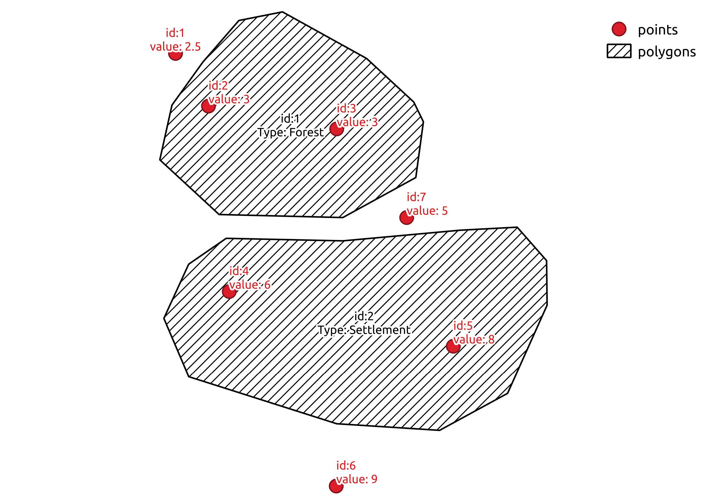
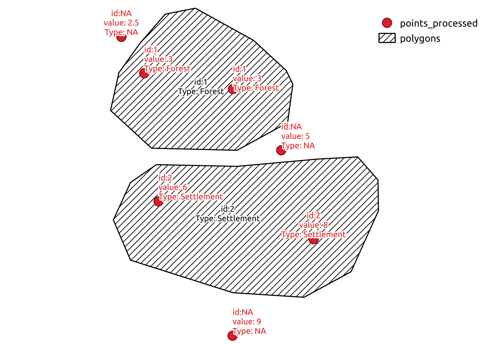

**Requirements**

Enable shapefiles `geo-types`-feature

`Cargo.toml`

```toml
[dependencies]
shapefile = {version = "0.3.0", features = ["geo-types"]}
...
```

# Example how to read a shapefile, convert it to a `geo` data structure and check for polygon-point intersection

The example program in `./src/bin/geotype-contains-example.rs`

1. reads the polygons in `./tests/data/polygons.shp` (ESRI Shapefile) and the points in `./tests/data/points.shp` (ESRI Shapefile)
2. Converts them to the `geo` data-structure
3. Checks which polygons contain which points and
4. Emit a message with the corresponding feature-ids.

# Example how to extract field-values from a polygon-shapefile of a csv-point dataset

The example program in `src/bin/geotype-csv-example.rs`

1. reads a polygon shapefile and point dataset in csv-Format
2. checks which polygon overlaps with the point
3. Adds the polygon-field-data to the point-dataset and updates the point
   field-data if field names are in polygon-shapefile _and_ point-csv-file
4. Writes point-csv-data with additional polygon field-values as output

## Usage of example program
You could reveal the usage  of the example program with `cargo run --bin geotype-csv-example -- --help`

```console
cargo run --bin geotype-csv-example -- --help
     Finished dev [unoptimized + debuginfo] target(s) in 0.02s
     Running `target/debug/geotype-csv-example --help`
read-polygon-shapefile-and-convert-to-geo-types

Program to get the polygon-field-value for each point in the csv-file

The program 1. reads a polygon shapefile and point dataset in csv-Format 2. checks which polygon
overlaps with the point 3. Adds the polygon-field-data to the point-dataset and updates the point
field-data if field names are in polygon-shapefile _and_ point-csv-file 4. Writes point-csv-data
with additional polygon field-values as output

USAGE:
    geotype-csv-example [OPTIONS] --polygon-file <polygon-file> [input]

ARGS:
    <input>
            xyz-point file with header-line

FLAGS:
    -h, --help
            Prints help information

    -V, --version
            Prints version information


OPTIONS:
    -n, --na <na>
            Value in output for missing (non overlapping) data [default: NA]

    -o, --output <output>
            Optional output xyz-file else stdout

    -p, --polygon-file <polygon-file>
            Polygon Shapefile

    -s, --sep <sep>
            Field seperator of xyz-point file [default:  ]

```

## Example usage

Running the program with the csv-point-input in file `tests/data/points.dat`:

```csv
x y id value
-0.70362473347548 0.834754797441365 1 2.5
-0.565031982942431 0.613006396588486 2 3
-0.0255863539445629 0.517057569296375 3 3
0.26865671641791 0.143923240938166 7 5
-0.477611940298508 -0.167377398720682 4 6
0.464818763326226 -0.397654584221748 5 8
-0.0277185501066098 -0.986140724946695 6 9
```

with the following command 

```bash
cargo run --bin geotype-csv-example -- \
    --polygon-file tests/data/polygons.shp  \
    tests/data/points.dat \
    > tests/data/points_processed.dat
```

This will result in the output

```csv
x y id value Type
-0.70362473347548 0.834754797441365 NA 2.5 NA
-0.565031982942431 0.613006396588486 1 3 Forest
-0.0255863539445629 0.517057569296375 1 3 Forest
0.26865671641791 0.143923240938166 NA 5 NA
-0.477611940298508 -0.167377398720682 2 6 Settlement
0.464818763326226 -0.397654584221748 2 8 Settlement
-0.0277185501066098 -0.986140724946695 NA 9 NA
```

So, visualizing the input 



will transform to 



